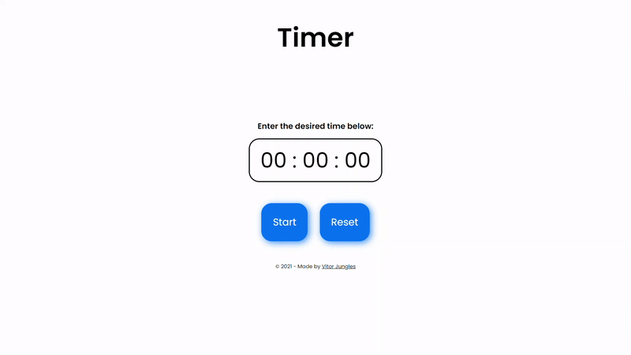

<h1 align="center">Timer</h1>

## :pushpin: What is this project?
This project is a practical and easy timer.

## :thinking: What is the objective of this project?
The aim of this project is to help the people organize their time better.

## :question: How does the Timer work?
Enter the desired time and the Timer will start instantly. When the time is up, the alarm will go off.

## :computer: What technologies are used?
This project was done with HTML5, CSS3 and JavaScript.

## :pencil: License
This project is under the MIT license. Read the file [LICENSE](https://github.com/vitorjungles/timer/blob/master/LICENSE) for more information.

## :arrow_right: How to access the Timer?
To access the Timer [click here](https://vitorjungles.github.io/timer/). :timer_clock: